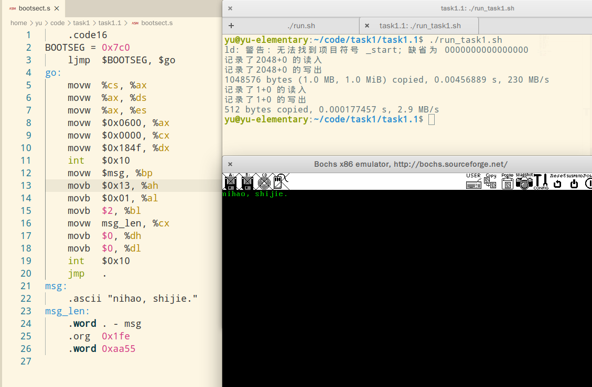
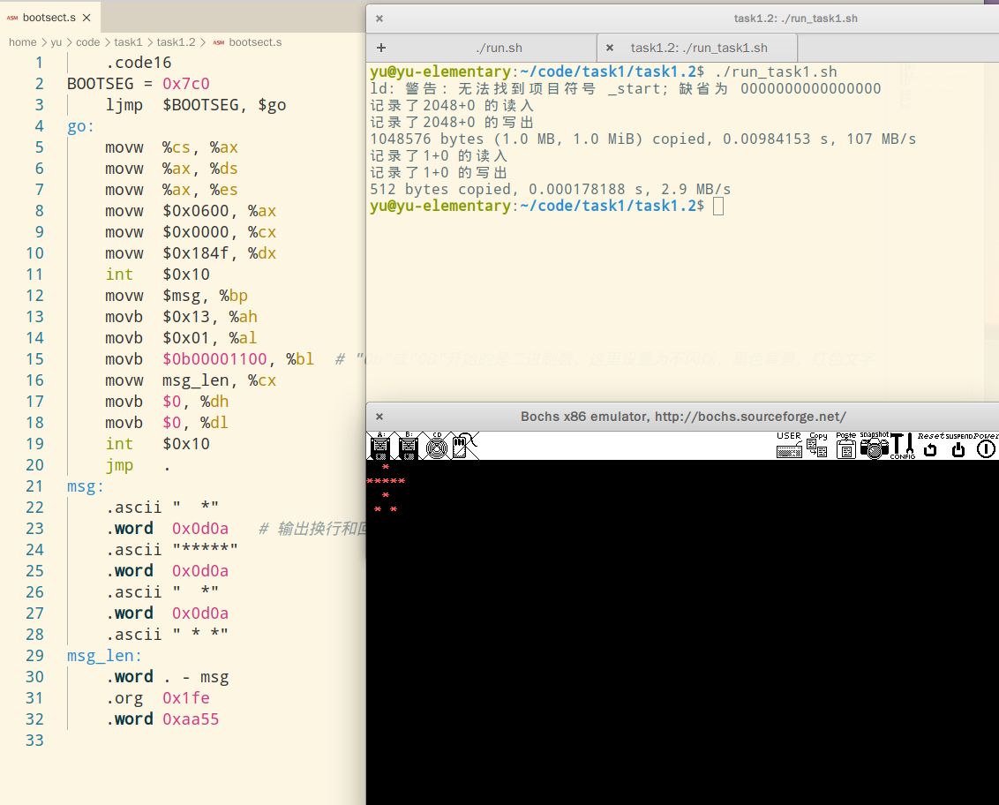
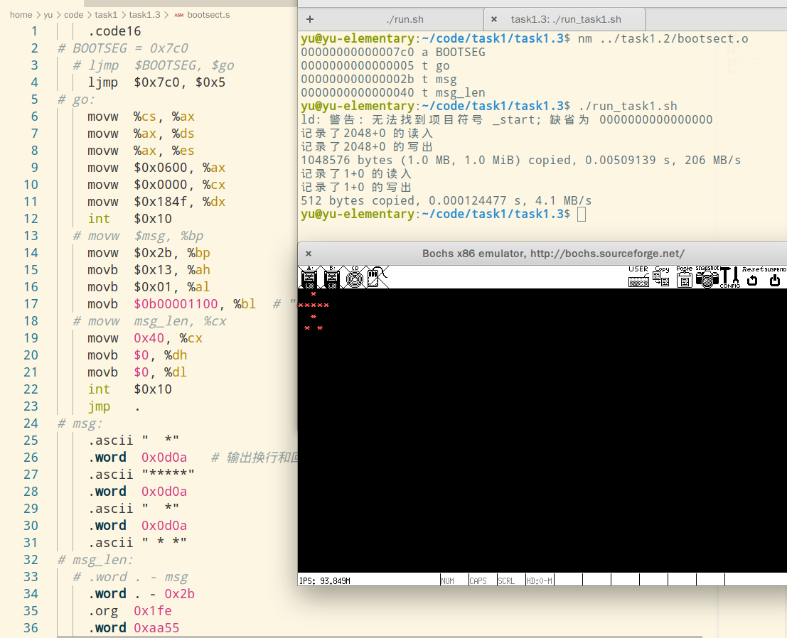
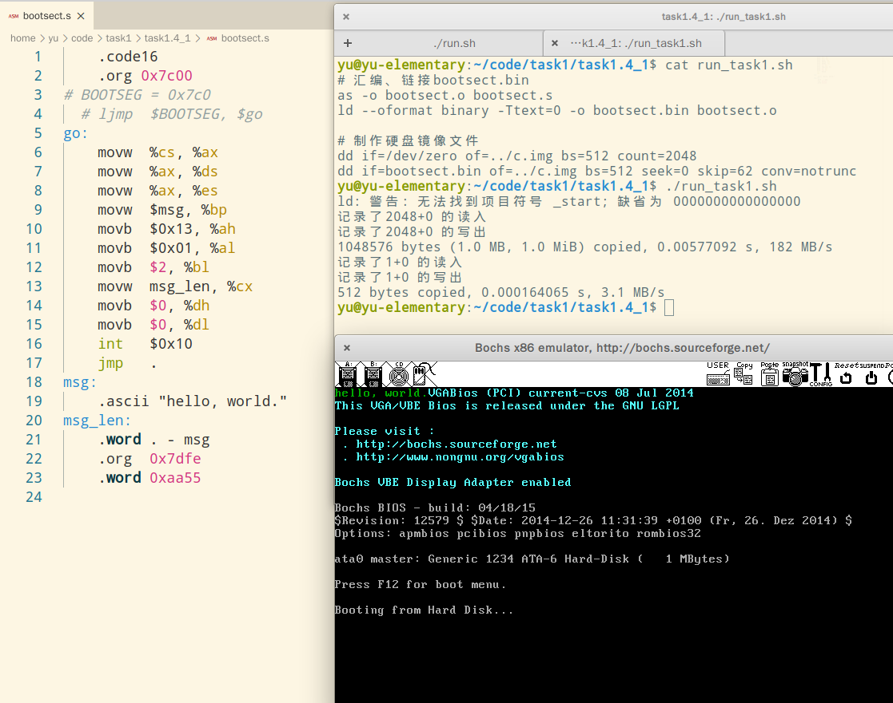
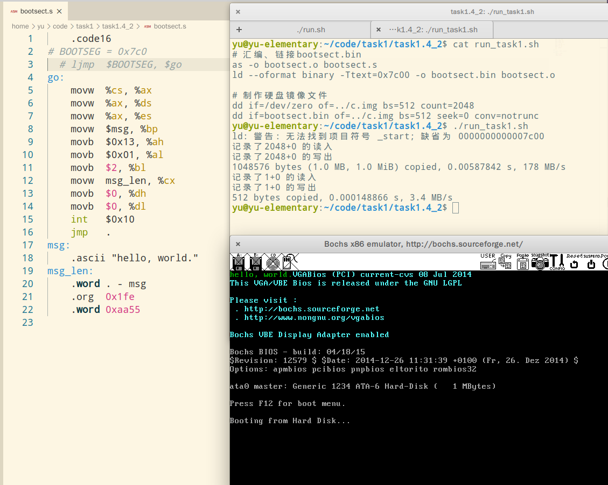
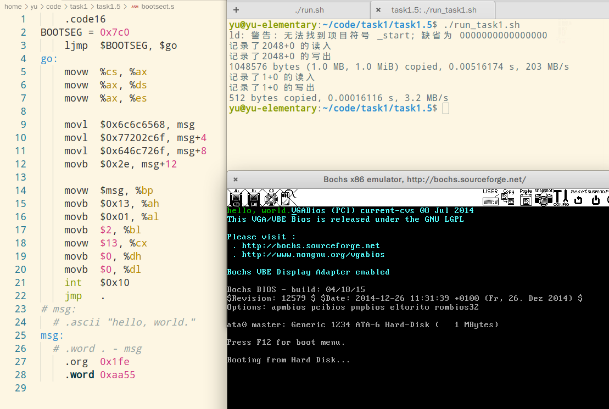

# task1 题解

答案不唯一，仅供参考

## task1.1

重写 test1 中的汇编程序 bootsect.s，实现：先调用 BIOS 中的 0x10 中断处理程序，清空显示器的屏幕上的所有内容，再往显示器的屏幕上打印字符串"ni hao, shi jie."。

**提示**：使用 0x10 号中断处理程序清屏，调用 0x10 号中断处理程序清屏时，所有的参数都是通过 cpu 中的寄存器传递的，用于参数传递的寄存器，及寄存器中的值表示的意义如下所示：

- 寄存器 ax：0x0600 表示清除显示器的屏幕上的一个矩形区域中的内容；
- 寄存器 (ch,cl)：矩形区域左上角的坐标，其中寄存器 ch 为行号，寄存器 cl 为列号；
- 寄存器 (dh,dl)：矩形区域右下角的坐标，其中寄存器 dh 为行号，寄存器 dl 为列号。

### 题解

要想实现目标，需要先存放指定字符串到内存中，这里还是采用 test1 中的方式用 `.ascii` 伪代码将其写入文件让 BIOS 将其加载入内存，直接在 test1 中修改`msg`处字符串即可。

然后根据上述提示，在打印字符串之前先设定好寄存器，调用 0x 10 号中断来清屏。

实现代码如下：

```assembly
    .code16
BOOTSEG = 0x7c0
    ljmp  $BOOTSEG, $go
go:
    movw  %cs, %ax
    movw  %ax, %ds
    movw  %ax, %es
    movw  $0x0600, %ax
    movw  $0x0000, %cx
    movw  $0x184f, %dx
    int   $0x10
    movw  $msg, %bp
    movb  $0x13, %ah
    movb  $0x01, %al
    movb  $2, %bl
    movw  msg_len, %cx
    movb  $0, %dh
    movb  $0, %dl
    int   $0x10
    jmp   .
msg:
    .ascii "nihao, shijie."
msg_len:
    .word . - msg
    .org  0x1fe
    .word 0xaa55

```

### 运行结果



## task1.2

在 task1.1 中的汇编程序 bootsect.s 的基础上，实现：先清空显示器的屏幕上的所有内容，再往显示器的屏幕上打印一架红色的 “字符飞机”。飞机造型如下所示：

```
  *
*****
  *
 * *
```

### 题解

参考task1.1，将输出格式（bl 寄存器）改为黑底红字，将需要输出的字符串改为飞机造型即可。0x0a 和 0x0d 分别是换行和回车的ASCII码。

实现代码如下：

```assembly
    .code16
BOOTSEG = 0x7c0
    ljmp  $BOOTSEG, $go
go:
    movw  %cs, %ax
    movw  %ax, %ds
    movw  %ax, %es
    movw  $0x0600, %ax
    movw  $0x0000, %cx
    movw  $0x184f, %dx
    int   $0x10
    movw  $msg, %bp
    movb  $0x13, %ah
    movb  $0x01, %al
    movb  $0b00001100, %bl  # "0b"或"0B"开始的是二进制数，这里设置为不闪烁，黑色背景，红色文字
    movw  msg_len, %cx
    movb  $0, %dh
    movb  $0, %dl
    int   $0x10
    jmp   .
msg:
    .ascii "  *"
    .word  0x0d0a   # 输出换行和回车(也可使用输出的起始位置行数来控制)
    .ascii "*****"
    .word  0x0d0a
    .ascii "  *"
    .word  0x0d0a
    .ascii " * *"
msg_len:
    .word . - msg
    .org  0x1fe
    .word 0xaa55

```

### 运行结果



## task1.3

修改 task1.2 中的汇编程序 `bootsect.s`，要求不使用任何符号，即删除所有的符号定义语句，并且在汇编指令和伪指令中使用符号表示的数替换符号。

**提示**：在实验 test1 中，在目录 test1 下从可执行文件 `bootsect.o` 中获取可执行文件 `bootsect.bin` 中所有的符号的值的命令为：`nm bootsect.o`。

### 题解

先将原始代码汇编链接，在终端中执行`nm bootsect.o`获取可执行文件 `bootsect.bin` 中所有的符号的值，然后将代码中所有的符号改为对应值即可。

```assembly
    .code16
# BOOTSEG = 0x7c0
  # ljmp  $BOOTSEG, $go
    ljmp  $0x7c0, $0x5
# go:
    movw  %cs, %ax
    movw  %ax, %ds
    movw  %ax, %es
    movw  $0x0600, %ax
    movw  $0x0000, %cx
    movw  $0x184f, %dx
    int   $0x10
  # movw  $msg, %bp
    movw  $0x2b, %bp
    movb  $0x13, %ah
    movb  $0x01, %al
    movb  $0b00001100, %bl  # "0b"或"0B"开始的是二进制数，这里设置为不闪烁，黑色背景，红色文字
  # movw  msg_len, %cx
    movw  0x40, %cx
    movb  $0, %dh
    movb  $0, %dl
    int   $0x10
    jmp   .
# msg:
    .ascii "  *"
    .word  0x0d0a   # 输出换行和回车(也可使用输出的起始位置行数来控制)
    .ascii "*****"
    .word  0x0d0a
    .ascii "  *"
    .word  0x0d0a
    .ascii " * *"
# msg_len:
  # .word . - msg
    .word . - 0x2b
    .org  0x1fe
    .word 0xaa55

```

### 运行截图



## task1.4

修改 test1 中的汇编程序 `bootsect.s`，要求在汇编程序 `bootsect.s` 中不修改寄存器 cs 的值。

**提示**：如小节1.2.5所述，在 cpu 运行可执行文件 `bootsect.bin` 前，BIOS 将寄存器 [cs:ip] 赋值为 [0x0:0x7c00]，即 cpu 运行可执行文件 `bootsect.bin` 时，代码段和数据段的物理段起始地址为 0，可执行文件 `bootsect.bin` 的第 1 条机器指令的偏移地址为 0x7c00。因此只要将可执行文件 `bootsect.bin` 的第 1 条机器指令的偏移地址设置为 0x7c00 即可，有 2 种方法：

1. 在汇编程序 `bootsect.s` 中，使用伪指令 org 将可执行文件 `bootsect.bin` 的第 1 条机器指令的偏移地址设置为 0x7c00；
2.  如小节1.2.3所述，在将可执行文件 `bootsect.o` 链接成可执行文件 `bootsect.bin` 时，使用-Ttext 参数将可执行文件 `bootsect.bin` 的第 1 条机器指令的偏移地址设置为 0x7c00；

### 题解

#### 方法一：

直接在`bootsect.s`开头使用`.org`伪指令将汇编后的程序的起始偏移设置为 0x7c00，然后同步将末尾的`.org` 伪指令的偏移地址改为0x7dfe（即原来的0x01fe+0x7c00）。

此时生成的代码前512B并不是我们所想让BIOS加载入内存的代码，我们需要在制作硬盘镜像的时候使用`skip=62`参数（第七行）来指定跳过生成文件的前62块（前62个512B，0x7c00B/512B=62），从第63个块开始写入磁盘镜像开头，作为磁盘镜像的第一块，使BIOS能正确加载我们所需要的代码。

修改`bootsect.s`代码如下：

```assembly
    .code16
    .org 0x7c00
# BOOTSEG = 0x7c0
  # ljmp  $BOOTSEG, $go
go:
    movw  %cs, %ax
    movw  %ax, %ds
    movw  %ax, %es
    movw  $msg, %bp
    movb  $0x13, %ah
    movb  $0x01, %al
    movb  $2, %bl
    movw  msg_len, %cx
    movb  $0, %dh
    movb  $0, %dl
    int   $0x10
    jmp   .
msg:
    .ascii "hello, world."
msg_len:
    .word . - msg
    .org  0x7dfe
    .word 0xaa55

```

同时需要修改`run_task1.sh`如下：

```shell
# 汇编、链接bootsect.bin
as -o bootsect.o bootsect.s
ld --oformat binary -Ttext=0 -o bootsect.bin bootsect.o

# 制作硬盘镜像文件
dd if=/dev/zero of=../c.img bs=512 count=2048
dd if=bootsect.bin of=../c.img bs=512 seek=0 skip=62 conv=notrunc

```



#### 方法二：

`bootsect.s`不做修改，修改`run_task1.sh`第三行，修改参数`-Ttext=0x7c00`，将可执行文件 `bootsect.bin` 的第 1 条机器指令的偏移地址设置为 0x7c00。

改动如下：

```shell
# 汇编、链接bootsect.bin
as -o bootsect.o bootsect.s
ld --oformat binary -Ttext=0x7c00 -o bootsect.bin bootsect.o

# 制作硬盘镜像文件
dd if=/dev/zero of=../c.img bs=512 count=2048
dd if=bootsect.bin of=../c.img bs=512 seek=0 conv=notrunc

```



## task1.5

首先，删除 test1 中的第 17 ~ 18 行伪指令。然后，在程序运行的过程中，使用汇编指令 `mov` 在 `bootsect.bin` 占用的内存中的某一位置处，写入"hello world." 字符串。最后，使用 BIOS 的 0x10 号中断打印该字符串。

提示：在代码清单 1.1 第 12 行中，`mov` 汇编指令是将物理内存中的数据赋值给寄存器，若将汇编指令修改为 `movw %cx, msg_len`，则表示将寄存器 cx 中的值写到物理内存中。

### 题解

这里字符串需要手动转换成 ASCII 码，将其多次赋值存入内存指定位置，参考代码第 9-12 行，`movl`可以一次赋值4个字节的内容（即4个字符），然后手动计算字符串的长度（13）赋值给cx寄存器，参考代码第 18 行。

代码如下：

```assembly
    .code16
BOOTSEG = 0x7c0
    ljmp  $BOOTSEG, $go
go:
    movw  %cs, %ax
    movw  %ax, %ds
    movw  %ax, %es

    movl  $0x6c6c6568, msg
    movl  $0x77202c6f, msg+4
    movl  $0x646c726f, msg+8
    movb  $0x2e, msg+12

    movw  $msg, %bp
    movb  $0x13, %ah
    movb  $0x01, %al
    movb  $2, %bl
    movw  $13, %cx
    movb  $0, %dh
    movb  $0, %dl
    int   $0x10
    jmp   .
# msg:
  # .ascii "hello, world."
msg:
  # .word . - msg
    .org  0x1fe
    .word 0xaa55

```

### 运行截图

